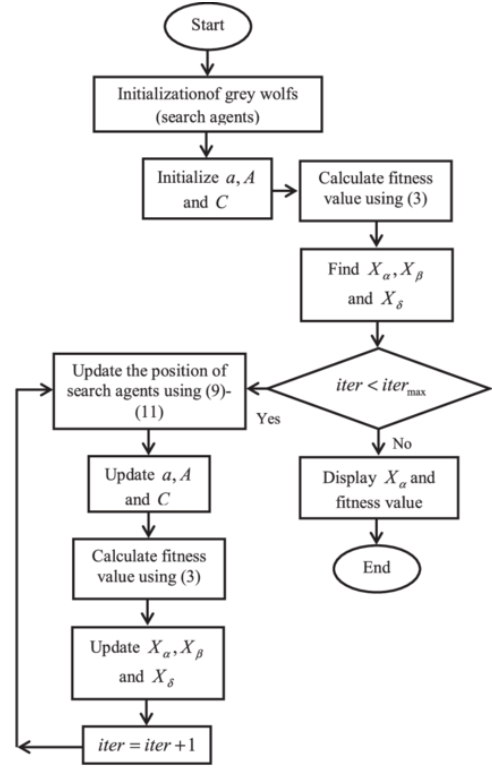
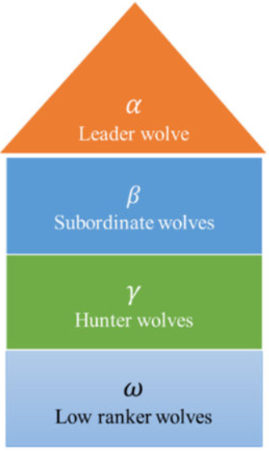

# Grey Wolf Optimization (GWO) Algorithm Notes

## Flowchart
<p align="center">
  
</p>

## Description
  - A population-based optimization algorithm inspired by the social hierarchy and hunting behavior of grey wolves.
  - It simulates the process of grey wolves hunting prey and updating their positions based on the positions of alpha, beta, delta, and omega wolves.
    
### 1. Initialization
- Initialize the positions of grey wolves randomly within the search space.
- Define the fitness function to evaluate the quality of solutions.
  
### 2. Social Hierarchy
  - **Alpha Wolves**: Represent the best solution found so far.
  - **Beta Wolves**: Represent the second-best solution.
  - **Delta Wolves**: Represent the third-best solution.
  - **Omega Wolves**: Represent the remaining wolves.

<p align="center">
  
</p>

### 3. Position Update
- Update the positions of wolves based on the current best solutions and social hierarchy.
- Use the following formulas to update positions:
  - **Alpha**:
    ```
    X_alpha = X_best + A1 * |C1 * X_best - X|
    ```
  - **Beta**:
    ```
    X_beta = X_best + A2 * |C2 * X_best - X|
    ```
  - **Delta**:
    ```
    X_delta = X_best + A3 * |C3 * X_best - X|
    ```
  - Where:
    - `X_best` is the best solution.
    - `A1`, `A2`, `A3` are coefficient vectors.
    - `C1`, `C2`, `C3` are random coefficient vectors.
    - `X` is the current position of the wolf.

### 4. Hunting Behavior
- Update the position of each wolf by balancing exploration and exploitation.
- Use a combination of alpha, beta, and delta wolves to guide the search.

### 5. Termination Condition
- Check if a stopping criterion (e.g., maximum number of iterations) is met.
- The best solution found during the iterations is considered the final output.

## Applications
- Continuous optimization problems.
- Engineering design problems.
- Benchmark functions in optimization.

## Troubleshooting
- Ensure proper initialization of parameters and fitness function.
- Monitor the convergence behavior and update strategies.
- Adjust the coefficients and parameters for better performance.

## References
- Research papers and literature on Grey Wolf Optimization for a deeper understanding and variations of the algorithm.
